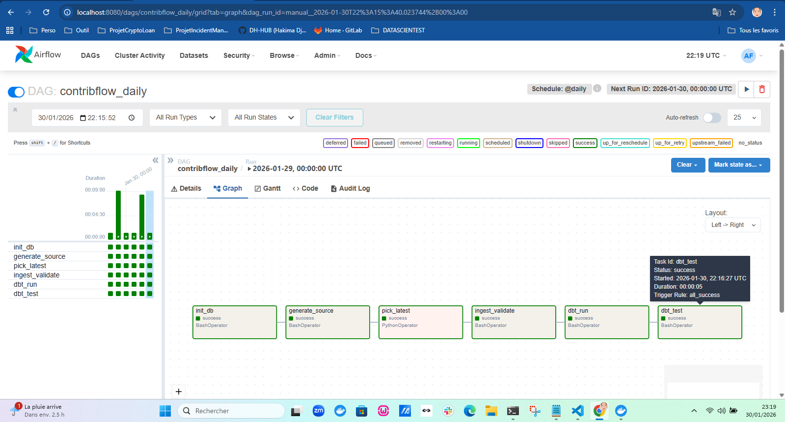
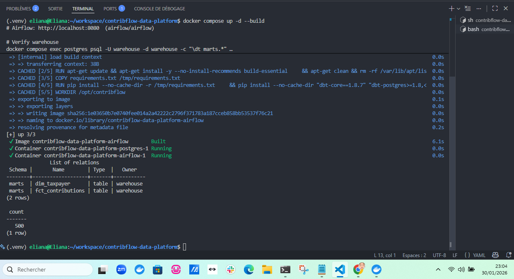
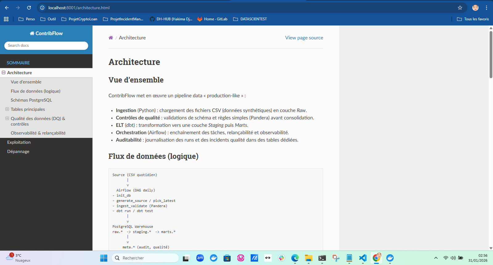

# ContribFlow — Plateforme Data Engineering (ETL/ELT) pour contributions directes
[](https://github.com/DH-HUB/contribflow-data-platform/actions/workflows/ci.yml)


# ContribFlow — Data Platform Blueprint

Mini plateforme data “production-like” démontrant :
- Orchestration : Airflow
- ELT : dbt (staging + marts + tests)
- Data Quality : Pandera + dbt tests
- Auditabilité : meta tables
- Warehouse : PostgreSQL
- DataOps : Docker, CI GitHub Actions
- Cloud Blueprint : AWS (S3 / RDS / MWAA / IAM)

Objectif : illustrer la conception d’un pipeline fiable, testable et auditable.

---

ContribFlow est un blueprint de plateforme data (format “enterprise”) qui illustre la conception et l’exploitation d’un pipeline fiable, testable et auditable dans un contexte réglementé (secteur public / finance).
Le projet met en œuvre un flux complet : ingestion → contrôles de qualité → ELT (dbt) → marts analytiques, orchestré par Airflow et stocké dans PostgreSQL.

> Les données sont 100% synthétiques (aucune donnée personnelle réelle).

---

## Demo

### Airflow — DAG exécuté avec succès (incluant les tests dbt)


### Warehouse — validation PostgreSQL (marts + comptage)


---

## Contexte métier

Les organisations manipulant des données de contributions/impôts fonctionnent sous fortes contraintes :
- **traçabilité / auditabilité** des mouvements de données,
- **contrôles d’intégrité** (qualité, cohérence, relations),
- principes **privacy-by-design** (RGPD et équivalents),
- **modernisation** des SI (migration legacy → plateforme data moderne).

ContribFlow simule un flux quotidien typique :
1. un système source émet un export journalier (CSV),
2. chargement en **Raw** (append-only + dédoublonnage),
3. transformations en **Staging** et **Marts** (dbt),
4. tests automatisés (dbt) et journalisation des exécutions.

---

## Fonctionnalités

### Orchestration (Airflow)
- DAG quotidien `contribflow_daily` :
  `init_db → generate_source → pick_latest → ingest_validate → dbt_run → dbt_test`
- Pipeline relançable (re-runnable) avec séparation claire des responsabilités.

### Stockage & modélisation (PostgreSQL + dbt)
- Schémas PostgreSQL :
  - `raw` (ingestion brute)
  - `staging` (modèles dbt de staging — souvent des vues)
  - `marts` (tables prêtes pour l’analyse)
  - `meta` (audit & qualité)
- Modèles dbt :
  - `staging.stg_contributions` (vue)
  - `marts.dim_taxpayer` (table)
  - `marts.fct_contributions` (table)
- Tests dbt :
  - `not_null`, `unique`, `relationships`

### Qualité & auditabilité
- Validation à l’ingestion avec **Pandera** (schéma + règles simples)
- Tables d’audit :
  - `meta.etl_run` (suivi des exécutions)
  - `meta.data_quality_issue` (anomalies détectées)

### DataOps
- Stack **Docker Compose** : Airflow + PostgreSQL
- Tests unitaires : `pytest`
- Lint : `ruff`
- CI GitHub Actions (`.github/workflows/ci.yml`)

### Trajectoire Cloud (AWS)
- Dossier `infra/terraform/` (squelette) : S3 / RDS / MWAA (à compléter selon votre contexte)
- Positionnement : logs/metrics (CloudWatch), secrets (Secrets Manager), IAM least-privilege, VPC privé.

---

## Architecture

### Vue logique
```text
(Synthetic source CSV)
        |
        v
     Airflow DAG
  - init schémas
  - génération & sélection du dernier fichier
  - ingestion raw + validation (Pandera)
  - dbt run + dbt test
        |
        v
PostgreSQL warehouse
  raw.*  -> staging.* (vues) -> marts.* (tables)
        |
        v
meta.* (audit + data quality)

```

## Objets PostgreSQL clés

- **`raw.contributions_raw`**  
  Données brutes + colonnes techniques : `ingestion_ts`, `source_file`, `record_hash`

- **`staging.stg_contributions` (dbt view)**  
  Normalisation / typage pour transformations aval

- **`marts.fct_contributions` (dbt table)**  
  Table de faits (analytique)

- **`marts.dim_taxpayer` (dbt table)**  
  Dimension contribuable pseudo-anonymisée (clé hachée)

- **`meta.etl_run`, `meta.data_quality_issue`**  
  Journalisation et audit (exécution + qualité)

---

## Démarrage rapide (local)

### Prérequis
- Docker + Docker Compose
# Notes d’exploitation (WSL / Docker Desktop)

Sur des environnements Windows/WSL, les bind mounts peuvent provoquer des soucis de permissions.
Pour éviter cela :

les logs dbt et les artefacts (target) sont dirigés vers /opt/airflow/... (writable) plutôt que vers /opt/contribflow/... (bind mount du repo).

### Lancer la stack

Les identifiants et paramètres sont définis via des variables d’environnement (voir `.env.example`).

### 4.1 Lancer la stack (Postgres + Airflow)
Avant le premier lancement, créer le fichier `.env` à partir du modèle fourni (`.env.example`), puis démarrer la stack :
```bash
docker compose up -d --build

```
### Airflow: http://localhost:8080  (airflow/airflow)

Airflow :
- UI : http://localhost:8080
- identifiants : définis dans `.env` (par défaut : `airflow / airflow`)

Postgres :
- host : localhost
- port : 5432
- identifiants warehouse : définis dans `.env` (par défaut : `warehouse / warehouse`)

# Lancer le pipeline

Déclencher le DAG dans Airflow : contribflow_daily
```bash
docker compose exec postgres psql -U warehouse -d warehouse -c "\dt marts.*"
docker compose exec postgres psql -U warehouse -d warehouse -c "select count(*) from marts.fct_contributions;"
```


### 4.2 Déclencher le pipeline
Dans l’UI Airflow, déclenchez le DAG : **`contribflow_daily`**

Le DAG :
1) génère un fichier source synthétique du jour
2) charge en `raw`
3) exécute validations (Pandera)
4) exécute dbt (staging + marts + tests)

---

## 5) Stratégie de qualité des données

Contrôles Python (Pandera) :
- `taxpayer_id` non nul
- `amount` >= 0
- `declaration_id` unique par fichier
- `event_date` parseable

Tests ELT (dbt) :

- unique / not_null sur les clés

- relationships entre marts.fct_contributions.taxpayer_key et marts.dim_taxpayer.taxpayer_key

- Toutes anomalies sont enregistrées dans `meta.data_quality_issue`.

---

## 6) Traçabilité & audit

Chaque run écrit dans `meta.etl_run` :
- `run_id` (UUID)
- horodatages
- statut (SUCCESS / FAILED)
- nombre de lignes ingérées
- fichier source

Objectif : **rejouabilité** + **auditabilité**.

---

## 7) Tests & CI

### Lancer les tests (local)
```bash
python -m venv .venv && source .venv/bin/activate
pip install -r requirements-dev.txt
pytest -q
```

### CI GitHub Actions
Workflow `.github/workflows/ci.yml` : lint + tests + couverture.

---

## 8) Documentation technique (Sphinx)

Squelette dans `docs/` (utile pour montrer la pratique).

```bash
cd docs
make html
cd _build/html
python -m http.server 8001
```

### Aperçu de la doc



## 9) Passage au Cloud (AWS) — blueprint

### Cible AWS
- **S3** : `raw/`, `processed/`, `dbt-artifacts/`
- **RDS PostgreSQL** : warehouse
- **MWAA** : orchestration Airflow
- **CloudWatch** : logs/metrics
- **Secrets Manager** : secrets DB
- **IAM** : least-privilege
- **VPC** : subnets privés pour RDS/MWAA

### Terraform
`infra/terraform/` fournit un squelette (S3 + RDS + placeholders MWAA).
---
##  Notes de sécurité

- Données **100 % synthétiques** (aucune donnée réelle).
- Services exposés **uniquement en local** (`127.0.0.1`).
- Secrets gérés via **variables d’environnement** (`.env.example` fourni, `.env` ignoré).
- Identifiants par défaut **à usage démonstration uniquement**.
- Configuration sensible Airflow non exposée dans l’UI.
> Les principes de sécurité sont appliqués dans un contexte **local**, à des fins de démonstration.  
> Bonnes pratiques en production :
> - Secrets via un **gestionnaire de secrets** (Vault, AWS Secrets Manager…)
> - **Aucune exposition** directe de la base (réseau privé, firewall/security groups)
> - **TLS**, rotation des identifiants, et comptes en **moindre privilège**


## 10) Évolutions possibles
- OpenMetadata (catalogue/lineage)
- Great Expectations / Soda (DQ avancée)
- CDC (Debezium) plutôt que fichiers
- Kubernetes / Helm
- Terraform modules complets + GitOps
- Chiffrement (KMS) + masquage PII (vues/politiques)

---
## Auteur : Hakima Djermouni
## Licence
MIT
